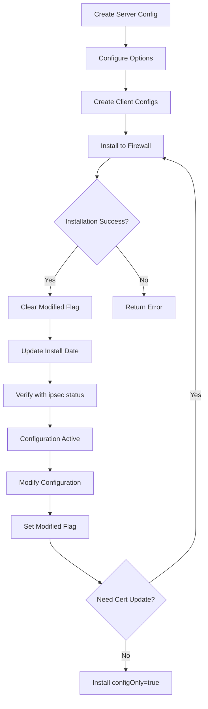

Deploy IPsec VPN configurations to firewalls using strongSwan and manage their installation lifecycle. These endpoints handle configuration files, certificates, and service management.

## Install IPsec Configuration

<api method="POST" endpoint="/api/fwclouds/{fwcloud}/firewalls/{firewall}/vpn/ipsecs/install">
  Installs an IPsec configuration on the target firewall with all required certificates
</api>

### Path Parameters

<ParamField path="fwcloud" type="number" required>
  FWCloud ID
</ParamField>

<ParamField path="firewall" type="number" required>
  Firewall ID where the configuration will be installed
</ParamField>

### Body Parameters

<ParamField body="firewall" type="number" required>
  Firewall ID (must match path parameter)
</ParamField>

<ParamField body="ipsec" type="number" required>
  IPsec configuration ID to install
</ParamField>

<ParamField body="sshuser" type="string">
  SSH username for firewall connection (if different from configured default)
</ParamField>

<ParamField body="sshpass" type="string">
  SSH password for firewall connection (if required)
</ParamField>

<ParamField body="configOnly" type="boolean">
  If true, only installs the configuration file without certificates and keys. Defaults to false.
</ParamField>

### Response

<ResponseField name="installName" type="string">
  Configuration filename that was installed (only returned for client installations)
</ResponseField>

<ResponseExample>
```json 200 Response - Client Installation
{
  "installName": "tunnel.conf"
}
```

```json 200 Response - Server Installation
{}
```
</ResponseExample>

<ResponseExample>
```bash cURL - Full Installation
curl -X POST \
  https://api.fwcloud.net/api/fwclouds/1/firewalls/5/vpn/ipsecs/install \
  -H 'Content-Type: application/json' \
  -d '{
    "firewall": 5,
    "ipsec": 58,
    "sshuser": "admin",
    "sshpass": "secure-password"
  }'
```

```bash cURL - Configuration Only
curl -X POST \
  https://api.fwcloud.net/api/fwclouds/1/firewalls/5/vpn/ipsecs/install \
  -H 'Content-Type: application/json' \
  -d '{
    "firewall": 5,
    "ipsec": 58,
    "configOnly": true
  }'
```
</ResponseExample>

### Installation Process

#### Server Installation (Full)
1. Establishes SSH connection to firewall
2. Generates complete configuration from database
3. **Main Configuration**: Installs `ipsec.conf` (or custom name) to install_dir
4. **CA Certificate**: Installs `ca-cert.crt` to `{install_dir}/ipsec.d/cacerts/`
5. **Server Certificate**: Installs `{cn}.crt` to `{install_dir}/ipsec.d/certs/`
6. **Client Certificates**: Installs all client certificates to `{install_dir}/ipsec.d/certs/`
7. **Private Key**: Installs `{cn}.key` to `{install_dir}/ipsec.d/private/`
8. **Secrets File**: Creates `ipsec.secrets` with RSA key reference
9. Updates installation status and timestamp
10. Clears "modified" flag

#### Client Installation
- Uses parent server's `install_dir` and `install_name`
- Generates configuration for parent server (includes all clients)
- Installs complete server configuration

#### Configuration-Only Installation
- Installs only the main `ipsec.conf` file
- Skips all certificate and key installation
- Useful for configuration updates without certificate changes

### File Locations

```
{install_dir}/
├── ipsec.conf                    # Main configuration
├── ipsec.secrets                 # Private key references
└── ipsec.d/
    ├── cacerts/
    │   └── ca-cert.crt          # CA certificate
    ├── certs/
    │   ├── server-cn.crt        # Server certificate
    │   ├── client1-cn.crt       # Client certificates
    │   └── client2-cn.crt
    └── private/
        └── server-cn.key        # Server private key
```

### Progress Events

WebSocket events during installation:
- `start`: Installation begins
- `message`: Progress updates from file transfers
- `end`: Installation completes

---

## Uninstall IPsec Configuration

<api method="POST" endpoint="/api/fwclouds/{fwcloud}/firewalls/{firewall}/vpn/ipsecs/uninstall">
  Removes an IPsec configuration from the target firewall
</api>

### Body Parameters

<ParamField body="firewall" type="number" required>
  Firewall ID
</ParamField>

<ParamField body="ipsec" type="number" required>
  IPsec configuration ID to uninstall
</ParamField>

<ParamField body="sshuser" type="string">
  SSH username for firewall connection
</ParamField>

<ParamField body="sshpass" type="string">
  SSH password for firewall connection
</ParamField>

### Response

Returns HTTP 200 with empty body on success.

<ResponseExample>
```bash cURL
curl -X POST \
  https://api.fwcloud.net/api/fwclouds/1/firewalls/5/vpn/ipsecs/uninstall \
  -H 'Content-Type: application/json' \
  -d '{
    "firewall": 5,
    "ipsec": 58
  }'
```
</ResponseExample>

### Uninstallation Process

#### Client Uninstallation
1. Determines parent server's `install_dir`
2. Removes client certificate from `{install_dir}/ipsec.d/certs/{cn}.crt`
3. Marks both client and parent server as modified

#### Server Uninstallation
1. Removes main configuration file and secrets:
   - `{install_dir}/{install_name}`
   - `{install_dir}/ipsec.secrets`
2. Removes all certificates:
   - Server cert: `{install_dir}/ipsec.d/certs/{cn}.crt`
   - Client certs: `{install_dir}/ipsec.d/certs/{client-cn}.crt`
3. Removes CA certificate: `{install_dir}/ipsec.d/cacerts/ca-cert.crt`
4. Removes private key: `{install_dir}/ipsec.d/private/{cn}.key`
5. Marks server as modified

---

## Get Configuration Filename

<api method="GET" endpoint="/api/fwclouds/{fwcloud}/firewalls/{firewall}/vpn/ipsecs/config-filename">
  Retrieves the configuration filename for a firewall's IPsec setup
</api>

### Response

<ResponseField name="install_name" type="string">
  Configuration filename
</ResponseField>

<ResponseField name="install_dir" type="string">
  Installation directory path
</ResponseField>

<ResponseExample>
```json 200 Response
{
  "install_name": "tunnel.conf",
  "install_dir": "/etc"
}
```
</ResponseExample>

---

## Notes

- Installation requires valid SSH credentials for the target firewall
- The firewall must have strongSwan installed and configured
- Installation directories must exist and be writable
- Standard strongSwan directory structure:
  - Main config: `/etc/ipsec.conf` or `/etc/ipsec.d/*.conf`
  - Certificates: `/etc/ipsec.d/cacerts/`, `/etc/ipsec.d/certs/`
  - Private keys: `/etc/ipsec.d/private/`
  - Secrets: `/etc/ipsec.secrets`
- Server configurations use their configured `install_dir` and `install_name`
- Client configurations inherit parent's directory and name
- The `configOnly` option is useful for quick config updates without touching certificates
- Status flags:
  - Bit 1: Modified (requires reinstallation)
  - `|1` sets the bit, `&~1` clears the bit

## Error Handling

- Returns HTTP 400 if `install_dir` or `install_name` is missing
- Returns HTTP 400 on SSH connection failures
- Returns HTTP 404 if firewall or IPsec configuration not found
- Error messages include details from SSH operations when available

## Installation Workflow



## Certificate Management

### Full Installation
- Use when setting up new server
- Use when adding/removing clients
- Use when certificates are renewed
- Installs all certificates and keys

### Configuration-Only Installation
- Use for option changes (e.g., changing `rightsubnet`)
- Use for adding connection definitions
- Faster than full installation
- Requires existing certificates to be in place

## Best Practices

- Test configurations in a development environment first
- Back up `/etc/ipsec.d/` before reinstalling
- Use strong private keys and keep them secure
- Set appropriate file permissions on private keys (0600)
- Use key-based SSH authentication when possible
- Monitor WebSocket events for installation progress
- Verify installation with `ipsec statusall` command
- Keep certificate expiration dates tracked
- Use `configOnly=true` for minor configuration changes
- Restart strongSwan service after installation: `ipsec restart`

## Troubleshooting

### Common Issues

1. **Certificate not found**: Ensure CA and server certificates are properly configured
2. **Permission denied**: Check SSH user has write access to installation directories
3. **Service won't start**: Verify configuration syntax with `ipsec checkconfig`
4. **Connection fails**: Check firewall rules allow UDP 500 and 4500, and ESP protocol
