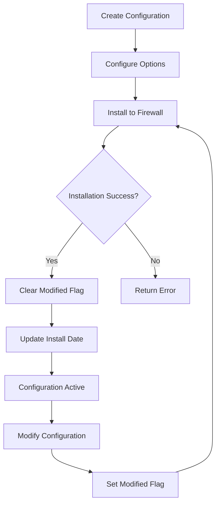

Deploy WireGuard VPN configurations to firewalls and manage their installation lifecycle. These endpoints handle the transfer of configuration files and activation of WireGuard tunnels.

## Install WireGuard Configuration

<api method="POST" endpoint="/api/fwclouds/{fwcloud}/firewalls/{firewall}/vpn/wireguards/install">
  Installs a WireGuard configuration on the target firewall
</api>

### Path Parameters

<ParamField path="fwcloud" type="number" required>
  FWCloud ID
</ParamField>

<ParamField path="firewall" type="number" required>
  Firewall ID where the configuration will be installed
</ParamField>

### Body Parameters

<ParamField body="firewall" type="number" required>
  Firewall ID (must match path parameter)
</ParamField>

<ParamField body="wireguard" type="number" required>
  WireGuard configuration ID to install
</ParamField>

<ParamField body="sshuser" type="string">
  SSH username for firewall connection (if different from configured default)
</ParamField>

<ParamField body="sshpass" type="string">
  SSH password for firewall connection (if required)
</ParamField>

### Response

<ResponseField name="installName" type="string">
  Configuration filename that was installed (only returned for client installations)
</ResponseField>

<ResponseExample>
```json 200 Response - Client Installation
{
  "installName": "wg0"
}
```

```json 200 Response - Server Installation
{}
```
</ResponseExample>

<ResponseExample>
```bash cURL
curl -X POST \
  https://api.fwcloud.net/api/fwclouds/1/firewalls/5/vpn/wireguards/install \
  -H 'Content-Type: application/json' \
  -d '{
    "firewall": 5,
    "wireguard": 42,
    "sshuser": "admin",
    "sshpass": "secure-password"
  }'
```
</ResponseExample>

### Installation Process

1. Establishes SSH connection to the firewall
2. Generates configuration file content from stored settings
3. Transfers configuration file to the installation directory
4. For server installations:
   - Installs main configuration file
   - Activates WireGuard interface
5. For client installations:
   - Retrieves parent server configuration
   - Uses parent's installation directory and name
   - Installs client configuration
6. Updates installation status and timestamp in database
7. Clears "modified" flag (status bit 1)

### Progress Events

The endpoint emits WebSocket events during installation:
- `start`: Installation begins
- `message`: Progress updates from SSH communication
- `end`: Installation completes

---

## Uninstall WireGuard Configuration

<api method="POST" endpoint="/api/fwclouds/{fwcloud}/firewalls/{firewall}/vpn/wireguards/uninstall">
  Removes a WireGuard configuration from the target firewall
</api>

### Body Parameters

<ParamField body="firewall" type="number" required>
  Firewall ID
</ParamField>

<ParamField body="wireguard" type="number" required>
  WireGuard configuration ID to uninstall
</ParamField>

<ParamField body="sshuser" type="string">
  SSH username for firewall connection
</ParamField>

<ParamField body="sshpass" type="string">
  SSH password for firewall connection
</ParamField>

### Response

Returns HTTP 200 with empty body on success.

<ResponseExample>
```bash cURL
curl -X POST \
  https://api.fwcloud.net/api/fwclouds/1/firewalls/5/vpn/wireguards/uninstall \
  -H 'Content-Type: application/json' \
  -d '{
    "firewall": 5,
    "wireguard": 42
  }'
```
</ResponseExample>

### Uninstallation Process

1. Connects to firewall via SSH
2. Stops WireGuard interface if running
3. Removes configuration file from installation directory
4. Updates status to mark configuration as modified (requires reinstallation)

---

## Get Configuration Filename

<api method="GET" endpoint="/api/fwclouds/{fwcloud}/firewalls/{firewall}/vpn/wireguards/config-filename">
  Retrieves the configuration filename for a firewall's WireGuard setup
</api>

### Response

<ResponseField name="install_name" type="string">
  Configuration filename
</ResponseField>

<ResponseField name="install_dir" type="string">
  Installation directory path
</ResponseField>

<ResponseExample>
```json 200 Response
{
  "install_name": "wg0",
  "install_dir": "/etc/wireguard"
}
```
</ResponseExample>

---

## Notes

- Installation requires valid SSH credentials for the target firewall
- The firewall must have WireGuard tools installed
- Installation directory must exist and be writable
- Server configurations use their own `install_dir` and `install_name`
- Client configurations inherit parent server's directory and name
- Status flags:
  - Bit 1: Modified (requires reinstallation)
  - `|1` sets the bit, `&~1` clears the bit
- WebSocket channel provides real-time progress updates during operations

## Error Handling

- Returns HTTP 400 if `install_dir` or `install_name` is missing
- Returns HTTP 400 on SSH connection failures
- Returns HTTP 404 if firewall or WireGuard configuration not found
- Error messages include details from SSH operations when available

## Installation Workflow



## Best Practices

- Test configurations in a development environment first
- Back up existing configurations before reinstalling
- Use strong SSH credentials and key-based authentication when possible
- Monitor WebSocket events for installation progress
- Verify configuration with `wg show` command after installation
- Keep installation paths consistent across servers
