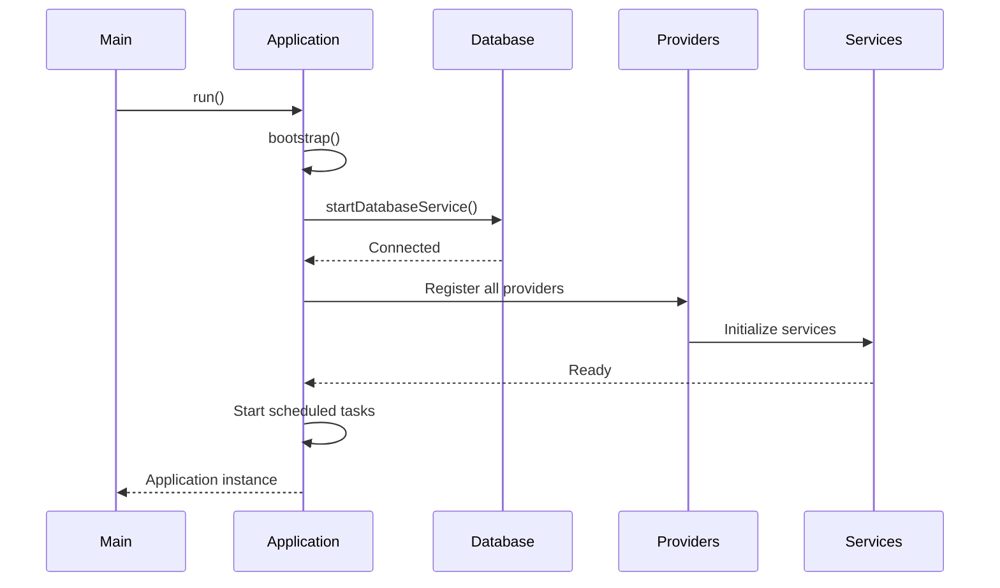
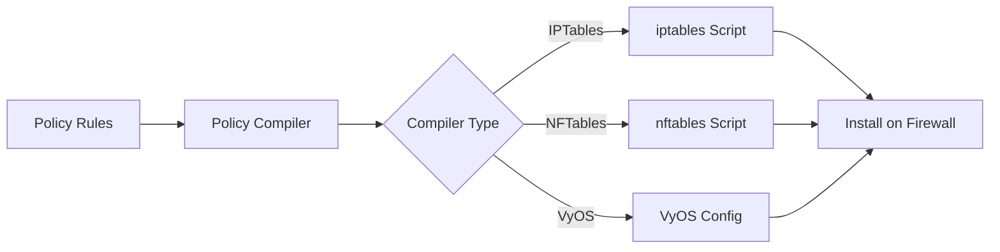

## Overview

FWCloud API is a Node.js/TypeScript application built on Express.js that provides a RESTful API for managing firewall configurations, VPN services, and network policies. The architecture follows a modular service-oriented design with clear separation of concerns.

## Application Structure

### HTTPApplication (Application.ts:89)

The main application class extends `HTTPApplication` and serves as the entry point for the entire system.

```typescript
export class Application extends HTTPApplication {
  public static async run(path?: string): Promise<Application> {
    const app: Application = new Application(path);
    await app.bootstrap();
    return app;
  }
}
```

**Key responsibilities:**
- Database connection management
- Service provider registration
- Middleware pipeline configuration
- Lifecycle management (startup/shutdown)

### Bootstrap Process

The application follows this initialization sequence:



## Service Providers (Application.ts:143-183)

The system uses a provider pattern to register and configure services:

### Core Providers

- **DatabaseServiceProvider**: Database connection and ORM management
- **RepositoryServiceProvider**: Data access layer repositories
- **RouterServiceProvider**: HTTP routing and endpoint registration
- **AuthorizationServiceProvider**: Authentication and authorization

### Feature Providers

- **FirewallServiceProvider**: Firewall management services
- **ClusterServiceProvider**: Firewall cluster operations
- **FwCloudServiceProvider**: FWCloud workspace management
- **OpenVPNServiceProvider**: OpenVPN configuration and management
- **WireGuardServiceProvider**: WireGuard VPN services
- **IPSecServiceProvider**: IPSec VPN services
- **PolicyRuleServiceProvider**: Firewall policy rules
- **RoutingTableServiceProvider**: Routing table management
- **BackupServiceProvider**: Backup and restore operations
- **WebSocketServiceProvider**: Real-time communication

## Middleware Pipeline (Application.ts:185-208)

Requests flow through this middleware pipeline:

### Before Middlewares

1. **LogRequestMiddleware**: Request logging
2. **BodyParser**: Parse request bodies
3. **RequestBuilder**: Build request context
4. **Compression**: Response compression
5. **MethodOverride**: HTTP method override
6. **MaintenanceMiddleware**: Maintenance mode check
7. **AuthorizationMiddleware**: User authentication
8. **AttachDatabaseConnection**: Attach DB connection to request
9. **SessionMiddleware**: Session management
10. **CORS**: Cross-origin resource sharing
11. **Authorization**: Permission checks
12. **ConfirmationToken**: Token validation
13. **InputValidation**: Request validation
14. **AccessControl**: Resource access control
15. **LockValidation**: Resource locking validation
16. **RestrictedMiddleware**: Restricted resource checks

### After Middlewares

1. **Throws404**: Handle 404 errors
2. **ErrorResponse**: Format error responses

## Server Layer (Server.ts:31-150)

The `Server` class wraps the Express application and manages HTTP/HTTPS servers:

```typescript
export class Server {
  private _application: Application;
  private _server: https.Server | http.Server;

  public async start(): Promise<any> {
    this._server = this.isHttps() ? 
      this.startHttpsServer() : 
      this.startHttpServer();
    this.bootstrapEvents();
    await this.bootstrapSocketIO();
  }
}
```

**Features:**
- TLS/SSL support with certificate management
- Socket.IO integration for real-time updates
- Configuration validation
- Graceful shutdown handling

## Data Layer

### ORM: TypeORM

FWCloud uses TypeORM for database abstraction with decorators:

```typescript
@Entity('fwcloud')
export class FwCloud extends Model {
  @PrimaryGeneratedColumn()
  id: number;

  @Column()
  name: string;

  @OneToMany((type) => Firewall, (firewall) => firewall.fwCloud)
  firewalls: Array<Firewall>;
}
```

### Repository Pattern

Repositories provide data access abstraction with custom query methods.

## Communication Layer

Firewall communication supports two protocols:

### SSH Communication

```typescript
if (this.install_communication === FirewallInstallCommunication.SSH) {
  return new SSHCommunication({
    host: ipobj.address,
    port: this.install_port,
    username: decrypt(this.install_user),
    password: decrypt(this.install_pass)
  });
}
```

### Agent Communication

```typescript
return new AgentCommunication({
  protocol: this.install_protocol,
  host: ipobj.address,
  port: this.install_port,
  apikey: decrypt(this.install_apikey)
});
```

## Compilation System

Firewall policies are compiled to native firewall scripts:



**Supported Compilers:**
- IPTables (Linux)
- NFTables (Modern Linux)
- VyOS (Network OS)

## File Storage

Each FWCloud has dedicated directories (FwCloud.ts:145-158):

- **PKI Directory**: Certificate authority and certificates
- **Policy Directory**: Compiled firewall scripts
- **Snapshot Directory**: Configuration snapshots

## Scheduled Tasks

The application runs scheduled tasks (Application.ts:133-137):

- **Backup Service**: Automated backups
- **OpenVPN Service**: Status monitoring and cleanup

## Security Features

### Session Management

- File-based sessions with keep-alive tracking
- Session timeout monitoring
- Multi-user support with proper isolation

### Resource Locking

- FWCloud-level locks prevent concurrent modifications
- Session-based lock ownership
- Automatic lock timeout and cleanup

### Encryption

- Sensitive credentials encrypted at rest
- TLS/SSL for API communication
- Secure key storage for VPN configurations

## Configuration Management

Configuration is managed through environment variables and config files:

- Database credentials
- Session secrets
- Encryption keys
- CORS whitelist
- API server settings (IP, port, TLS)

## Technology Stack

- **Runtime**: Node.js
- **Language**: TypeScript
- **Framework**: Express.js
- **ORM**: TypeORM
- **Database**: MySQL/MariaDB
- **WebSockets**: Socket.IO
- **Authentication**: Session-based
- **Cryptography**: Built-in crypto module
