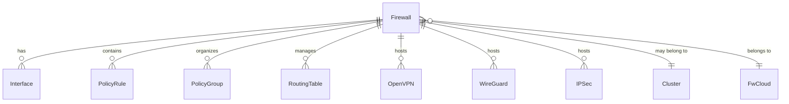
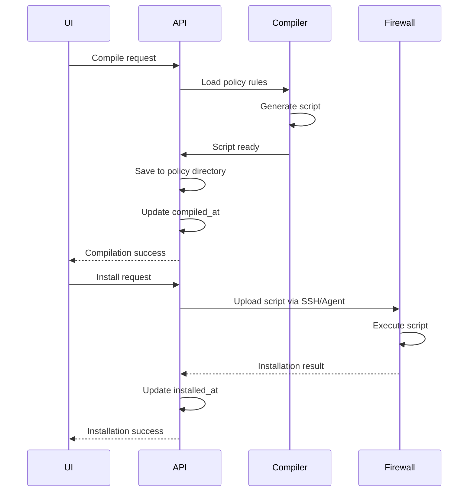

## Firewall Entity

A **Firewall** represents a managed firewall appliance or server running a firewall. It contains configuration, policies, interfaces, and VPN services.

## Data Model

### Entity Definition (Firewall.ts:125-261)

```typescript
@Entity('firewall')
export class Firewall extends Model {
  @PrimaryGeneratedColumn()
  id: number;

  @Column()
  name: string;

  @Column()
  comment: string;

  @Column()
  status: number;

  @Column()
  compiled_at: Date;

  @Column()
  installed_at: Date;

  @Column()
  options: number;

  @Column({ name: 'fwcloud' })
  fwCloudId: number;

  @ManyToOne((type) => FwCloud, (fwcloud) => fwcloud.firewalls)
  @JoinColumn({ name: 'fwcloud' })
  fwCloud: FwCloud;

  @Column({ name: 'cluster' })
  clusterId: number;

  @ManyToOne((type) => Cluster, (cluster) => cluster.firewalls)
  @JoinColumn({ name: 'cluster' })
  cluster: Cluster;
}
```

### Key Properties

| Property | Type | Description |
|----------|------|-------------|
| `id` | number | Unique identifier |
| `name` | string | Firewall name |
| `status` | number | Compilation/installation status bitmap |
| `compiled_at` | Date | Last successful compilation timestamp |
| `installed_at` | Date | Last successful installation timestamp |
| `options` | number | Feature flags bitmap |
| `fwCloudId` | number | Parent FWCloud |
| `clusterId` | number | Cluster ID (null for standalone) |

## Firewall Relationships



### Interfaces (Firewall.ts:211-212)

```typescript
@OneToMany((type) => Interface, (_interface) => _interface.firewall)
interfaces: Array<Interface>;
```

Network interfaces configured on the firewall.

### Policy Rules (Firewall.ts:226-227)

```typescript
@OneToMany((type) => PolicyRule, (policyRule) => policyRule.firewall)
policyRules: Array<PolicyRule>;
```

Filtering and NAT rules applied to traffic.

### VPN Services

```typescript
@OneToMany((type) => OpenVPN, (openVPN) => openVPN.firewall)
openVPNs: Array<OpenVPN>;

@OneToMany((type) => WireGuard, (wireGuard) => wireGuard.firewall)
wireGuards: Array<WireGuard>;

@OneToMany((type) => IPSec, (ipSec) => ipSec.firewall)
ipSecs: Array<IPSec>;
```

VPN server and client configurations.

### Routing Tables (Firewall.ts:229-230)

```typescript
@OneToMany((type) => RoutingTable, (routingTable) => routingTable.firewall)
routingTables: RoutingTable[];
```

Policy-based routing and static routes.

## Install Communication

### Communication Types (Firewall.ts:79-82)

```typescript
export enum FirewallInstallCommunication {
  SSH = 'ssh',
  Agent = 'agent'
}
```

### SSH Communication

Connect via SSH with username/password:

```typescript
@Column({ type: 'enum', enum: FirewallInstallCommunication })
install_communication: FirewallInstallCommunication;

@Column()
install_user: string;  // Encrypted

@Column()
install_pass: string;  // Encrypted

@Column()
install_port: number;  // Default: 22
```

### Agent Communication

Connect via FWCloud Agent with API key:

```typescript
@Column({ type: 'enum', enum: FirewallInstallProtocol })
install_protocol: FirewallInstallProtocol;  // http or https

@Column()
install_apikey: string;  // Encrypted

@Column()
install_port: number;  // Default: 33033
```

### Getting Communication Channel (Firewall.ts:273-302)

```typescript
async getCommunication(
  custom: { sshuser?: string; sshpassword?: string } = {}
): Promise<Communication<unknown>> {
  if (this.install_communication === FirewallInstallCommunication.SSH) {
    return new SSHCommunication({
      host: (await IPObj.findOne(this.install_ipobj)).address,
      port: this.install_port,
      username: custom.sshuser ?? decrypt(this.install_user),
      password: custom.sshpassword ?? decrypt(this.install_pass)
    });
  }
  
  return new AgentCommunication({
    protocol: this.install_protocol,
    host: (await IPObj.findOne(this.install_ipobj)).address,
    port: this.install_port,
    apikey: decrypt(this.install_apikey)
  });
}
```

## Options and Flags

### Firewall Option Flags (Firewall.ts:112-123)

```typescript
export enum FireWallOptMask {
  STATEFUL       = 0x0001,  // Enable connection tracking
  IPv4_FORWARDING = 0x0002,  // Enable IPv4 forwarding
  IPv6_FORWARDING = 0x0004,  // Enable IPv6 forwarding
  DEBUG          = 0x0008,  // Enable debug logging
  LOG_ALL        = 0x0010,  // Log all traffic
  DOCKER_COMPAT  = 0x0020,  // Docker compatibility rules
  CROWDSEC_COMPAT = 0x0040,  // CrowdSec integration
  FAIL2BAN_COMPAT = 0x0080,  // Fail2Ban integration
  PDR_WARNING    = 0x0100,  // Pending dangerous rules warning
  PDR_CRITICAL   = 0x0200   // Pending dangerous rules critical
}
```

### Plugin Flags (Firewall.ts:89-109)

```typescript
export enum PluginsFlags {
  openvpn = 'openvpn',
  wireguard = 'wireguard',
  ipsec = 'ipsec',
  geoip = 'geoip',
  crowdsec = 'crowdsec',
  suricata = 'suricata',
  keepalived = 'keepalived',
  haproxy = 'haproxy',
  isc_dhcp = 'isc-dhcp',
  // ... and more
}
```

## Compilation and Installation

### Status Tracking

The `status` field is a bitmap tracking:
- Needs compilation
- Needs installation
- Compilation errors
- Installation errors

### Policy Compilation



### Compiler Types (Firewall.ts:1538-1556)

```typescript
public static getFirewallCompiler(
  fwcloud: number,
  firewall: number
): Promise<AvailablePolicyCompilers> {
  // Compiler stored in 4 most significant bits
  const compilerNumber = (await getFirewallOptions()) & 0xf000;
  
  if (compilerNumber == 0x0000) return 'IPTables';
  else if (compilerNumber == 0x1000) return 'NFTables';
  else if (compilerNumber == 0x2000) return 'VyOS';
}
```

### Policy File Path (Firewall.ts:304-315)

```typescript
public getPolicyFilePath(): string {
  return path.join(
    app().config.get('policy').data_dir,
    this.fwCloudId.toString(),
    this.id.toString(),
    app().config.get('policy').script_name
  );
}
```

## Firewall Clusters

### Cluster Entity (Cluster.ts:43-80)

```typescript
@Entity('cluster')
export class Cluster extends Model {
  @PrimaryGeneratedColumn()
  id: number;

  @Column()
  name: string;

  @Column()
  comment: string;

  @Column({ name: 'fwcloud' })
  fwCloudId: number;

  @ManyToOne((type) => FwCloud, (fwcloud) => fwcloud.clusters)
  @JoinColumn({ name: 'fwcloud' })
  fwCloud: FwCloud;

  @OneToMany((type) => Firewall, (firewall) => firewall.cluster)
  firewalls: Array<Firewall>;
}
```

### Master/Slave Architecture

Clusters support high-availability with one master firewall:

```typescript
@Column()
fwmaster: number;  // 1 for master, 0 for slaves
```

**Characteristics:**
- Master holds the canonical configuration
- Slaves synchronize interfaces from master
- Only one master per cluster
- Policies compiled identically for all nodes

### Cluster Operations

#### Get Cluster with Nodes (Cluster.ts:96-141)

```typescript
public static getCluster(req): Promise<void> {
  // Returns cluster with:
  // - All firewall nodes
  // - Master firewall interfaces
  // - Cluster metadata
}
```

#### Promote to Master (Firewall.ts:818-825)

```typescript
public static promoteToMaster(dbCon, firewall): Promise<void> {
  dbCon.query(
    `UPDATE firewall SET fwmaster=1 WHERE id=${firewall}`
  );
}
```

## Status Management

### Updating Status (Firewall.ts:779-790)

```typescript
public static updateFirewallStatus(
  fwcloud, 
  firewall, 
  status_action  // e.g., "|1" to set bit, "&~1" to clear bit
): Promise<{ result: boolean }>
```

### Status Propagation

Changes to IP objects, interfaces, or groups automatically update affected firewall status (Firewall.ts:827-1117):

```typescript
public static async updateFirewallStatusIPOBJ(
  fwcloudId: number,
  ipObjIds: number[]
): Promise<void> {
  // Find all firewalls using these IP objects in:
  // - Policy rules
  // - Routes
  // - Routing rules
  // Mark them as needing recompilation
}
```

## CRUD Operations

### Creating a Firewall (Firewall.ts:657-668)

```typescript
public static insertFirewall(firewallData) {
  const data = {
    fwcloud: firewallData.fwcloud,
    cluster: firewallData.cluster || null,
    name: firewallData.name,
    comment: firewallData.comment,
    options: firewallData.options,
    install_communication: firewallData.install_communication,
    install_port: firewallData.install_port || 22
  };
  connection.query('INSERT INTO firewall SET ?', data);
}
```

### Updating a Firewall (Firewall.ts:698-729)

```typescript
public static updateFirewall(dbCon, iduser, firewallData) {
  // Updates:
  // - Basic info (name, comment)
  // - Install credentials (encrypted)
  // - Communication settings
  // - Options and plugins
}
```

### Deleting a Firewall (Firewall.ts:1403-1445)

```typescript
public static deleteFirewall = (
  user, 
  fwcloud, 
  firewall
): Promise<void> => {
  // Cascade deletion:
  // 1. Policy rules
  // 2. VPN configurations (OpenVPN, WireGuard, IPSec)
  // 3. VPN prefixes
  // 4. Interfaces and IP objects
  // 5. Tree nodes
  // 6. Policy directory
  // 7. Firewall record
}
```

## Best Practices

### Naming Conventions

- Use descriptive names: `fw-prod-edge-01`, `cluster-ha-dmz`
- Include location or function identifiers
- Add detailed comments

### Clusters

- Use clusters for high-availability setups
- Ensure master is the most reliable node
- Test failover procedures
- Keep slave configurations synchronized

### Security

- Use Agent communication when possible (more secure than SSH passwords)
- Rotate credentials regularly
- Use strong API keys
- Enable TLS for agent communication

### Status Management

- Compile after making policy changes
- Test compilation before installation
- Install during maintenance windows
- Monitor installation status

### Options

- Enable stateful firewall for connection tracking
- Use Docker compatibility only if Docker is installed
- Enable logging selectively (can impact performance)
- Configure appropriate forwarding options for routers
