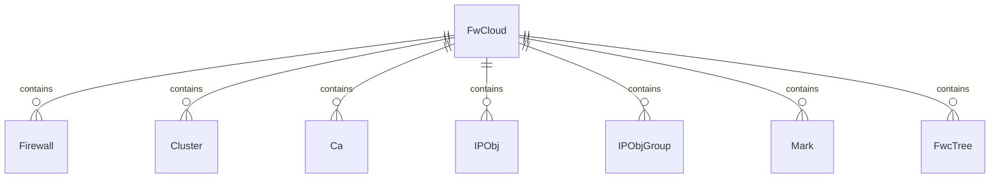

## What is a FWCloud?

A **FWCloud** is the top-level organizational unit in FWCloud API. It represents a workspace that contains all related firewall configurations, network objects, VPN setups, and policies. Think of it as a project or environment that groups together all your firewall infrastructure.

## Data Model

### Entity Definition (FwCloud.ts:76-142)

```typescript
@Entity('fwcloud')
export class FwCloud extends Model {
  @PrimaryGeneratedColumn()
  id: number;

  @Column()
  name: string;

  @Column()
  created_at: Date;

  @Column()
  updated_at: Date;

  @Column()
  locked: boolean;

  @Column()
  locked_at: Date;

  @Column()
  locked_by: string;

  @Column()
  image: string;

  @Column()
  comment: string;
}
```

### Key Properties

| Property | Type | Description |
|----------|------|-------------|
| `id` | number | Unique identifier |
| `name` | string | Display name for the FWCloud |
| `locked` | boolean | Whether the FWCloud is currently locked |
| `locked_by` | string | Session ID of the user who locked it |
| `locked_at` | Date | Timestamp when locked |
| `image` | string | Custom image/icon identifier |
| `comment` | string | Description or notes |

## Relationships

### One-to-Many Relationships



#### Firewalls (FwCloud.ts:125-126)

```typescript
@OneToMany((type) => Firewall, (firewall) => firewall.fwCloud)
firewalls: Array<Firewall>;
```

All standalone firewalls in this FWCloud.

#### Clusters (FwCloud.ts:122-123)

```typescript
@OneToMany((type) => Cluster, (cluster) => cluster.fwCloud)
clusters: Array<Cluster>;
```

Firewall clusters for high availability configurations.

#### Certificate Authorities (FwCloud.ts:119-120)

```typescript
@OneToMany((type) => Ca, (ca) => ca.fwCloud)
cas: Array<Ca>;
```

PKI certificate authorities for VPN certificates.

#### IP Objects (FwCloud.ts:131-132)

```typescript
@OneToMany((type) => IPObj, (ipobj) => ipobj.fwCloud)
ipObjs: Array<IPObj>;
```

Network objects (IPs, networks, hosts, services) used in policies.

#### IP Object Groups (FwCloud.ts:134-135)

```typescript
@OneToMany((type) => IPObjGroup, (ipObjGroup) => ipObjGroup.fwCloud)
ipObjGroups: Array<IPObjGroup>;
```

Groupings of IP objects for easier policy management.

#### Marks (FwCloud.ts:137-138)

```typescript
@OneToMany((type) => Mark, (mark) => mark.fwCloud)
marks: Array<Mark>;
```

Packet marking objects for advanced routing and QoS.

#### Tree Nodes (FwCloud.ts:128-129)

```typescript
@OneToMany((type) => FwcTree, (fwcTree) => fwcTree.fwCloud)
fwcTrees: Array<FwcTree>;
```

Hierarchical tree structure for organizing objects in the UI.

### Many-to-Many Relationships

#### Users (FwCloud.ts:111-117)

```typescript
@ManyToMany((type) => User, (user) => user.fwClouds)
@JoinTable({
  name: 'user__fwcloud',
  joinColumn: { name: 'fwcloud' },
  inverseJoinColumn: { name: 'user' }
})
users: Array<User>;
```

Multiple users can have access to a FWCloud, and users can access multiple FWClouds.

## Directory Structure

Each FWCloud automatically creates dedicated directories upon creation (FwCloud.ts:151-158):

### PKI Directory (FwCloud.ts:336-342)

```typescript
public getPkiDirectoryPath(): string {
  return path.join(
    app().config.get('pki').data_dir, 
    this.id.toString()
  );
}
```

Stores:
- Certificate Authority (CA) certificates and keys
- Server certificates
- Client certificates
- Certificate Revocation Lists (CRLs)

### Policy Directory (FwCloud.ts:348-355)

```typescript
public getPolicyDirectoryPath(): string {
  return path.join(
    app().config.get('policy').data_dir,
    this.id.toString()
  );
}
```

Stores:
- Compiled firewall scripts
- Policy configuration files
- Per-firewall subdirectories

### Snapshot Directory (FwCloud.ts:361-368)

```typescript
public getSnapshotDirectoryPath(): string {
  return path.join(
    app().config.get('snapshot').data_dir,
    this.id.toString()
  );
}
```

Stores:
- Configuration snapshots
- Backup files
- Rollback points

## Locking Mechanism

FWClouds implement a locking system to prevent concurrent modifications by multiple users.

### Lock States

```typescript
export interface FwcLock {
  access: boolean;      // User has access to the FWCloud
  locked: boolean;      // FWCloud is currently locked
  locked_at: string;    // When it was locked
  locked_by: number;    // Session ID that locked it
  mylock: boolean;      // Current user owns the lock
}
```

### Acquiring a Lock (FwCloud.ts:684-788)

```typescript
public static updateFwcloudLock(fwcloudData: FwcData): Promise<FwcLockData>
```

**Process:**
1. Check for lock timeout
2. Verify user has access
3. Check if unlocked or locked by same session
4. Acquire lock with timestamp
5. Return lock status

### Releasing a Lock (FwCloud.ts:816-838)

```typescript
public static updateFwcloudUnlock(fwcloudData): Promise<{ result: boolean }>
```

Only the session that acquired the lock can release it.

### Lock Timeout (FwCloud.ts:533-606)

```typescript
static async checkFwcloudLockTimeout(fwcloudId: number): Promise<void>
```

Automatically releases locks when:
- Session file doesn't exist
- Keep-alive timestamp exceeds threshold
- Session has expired

## User Access Control

### Multi-User Access

Administrators can grant users access to specific FWClouds through the `user__fwcloud` junction table.

### Getting User's FWClouds (FwCloud.ts:393-403)

```typescript
public static getFwclouds(dbCon, user): Promise<FwCloud[]> {
  const sql = `SELECT DISTINCT C.* FROM fwcloud C
    INNER JOIN user__fwcloud U ON C.id=U.fwcloud
    WHERE U.user=${user} ORDER BY C.name`;
  return dbCon.query(sql);
}
```

### Checking Access (FwCloud.ts:461-518)

```typescript
public static getFwcloudAccess(
  iduser, 
  fwcloud, 
  lock_session_id
): Promise<FwcLock>
```

Validates:
- User has access to the FWCloud
- Current lock status
- Lock ownership

## CRUD Operations

### Creating a FWCloud (FwCloud.ts:633-656)

```typescript
public static insertFwcloud(req) {
  const fwcloudData = {
    name: req.body.name,
    image: req.body.image,
    comment: req.body.comment
  };
  // Insert FWCloud
  // Grant access to all admin users
  // Create data directories
}
```

Automatically:
- Creates database record
- Grants access to all administrators
- Creates PKI, policy, and snapshot directories

### Deleting a FWCloud (FwCloud.ts:190-329)

```typescript
public async remove(options?: RemoveOptions): Promise<this>
```

**Cascade deletion order:**
1. Tree nodes (bottom-up)
2. Policy rules and relational tables
3. Routing rules and tables
4. DHCP, HAProxy, Keepalived rules
5. VPN configurations (OpenVPN, WireGuard, IPSec)
6. PKI entities (certificates, CAs)
7. Object groups
8. IP objects and marks
9. Interfaces
10. Clusters and firewalls
11. User access mappings
12. FWCloud itself
13. Data directories (PKI, policy, snapshots)

This ensures referential integrity without disabling foreign key checks.

## Best Practices

### Organization

- Create separate FWClouds for different environments (dev, staging, production)
- Use descriptive names and comments
- Assign appropriate user access permissions

### Locking

- Always release locks when done editing
- Use lock force override carefully (only administrators)
- Monitor lock timeouts to prevent stale locks

### Backups

- Regularly snapshot FWCloud configurations
- Test restore procedures
- Store backups in separate locations

### Deletion

- Export important configurations before deletion
- Verify no critical firewalls are in use
- Understand that deletion is permanent and cascades to all contained entities
