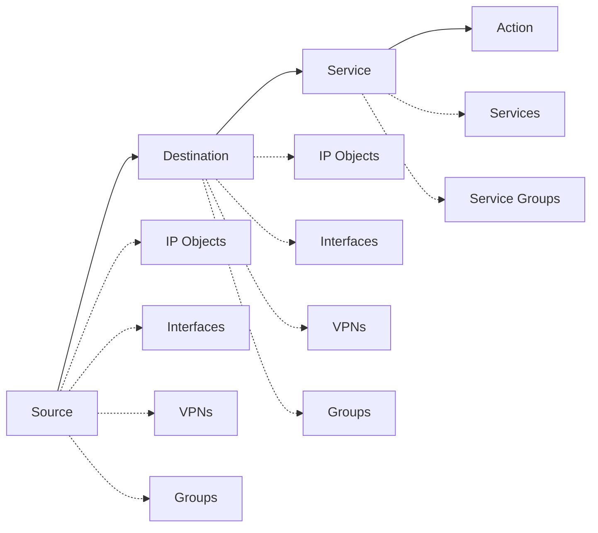
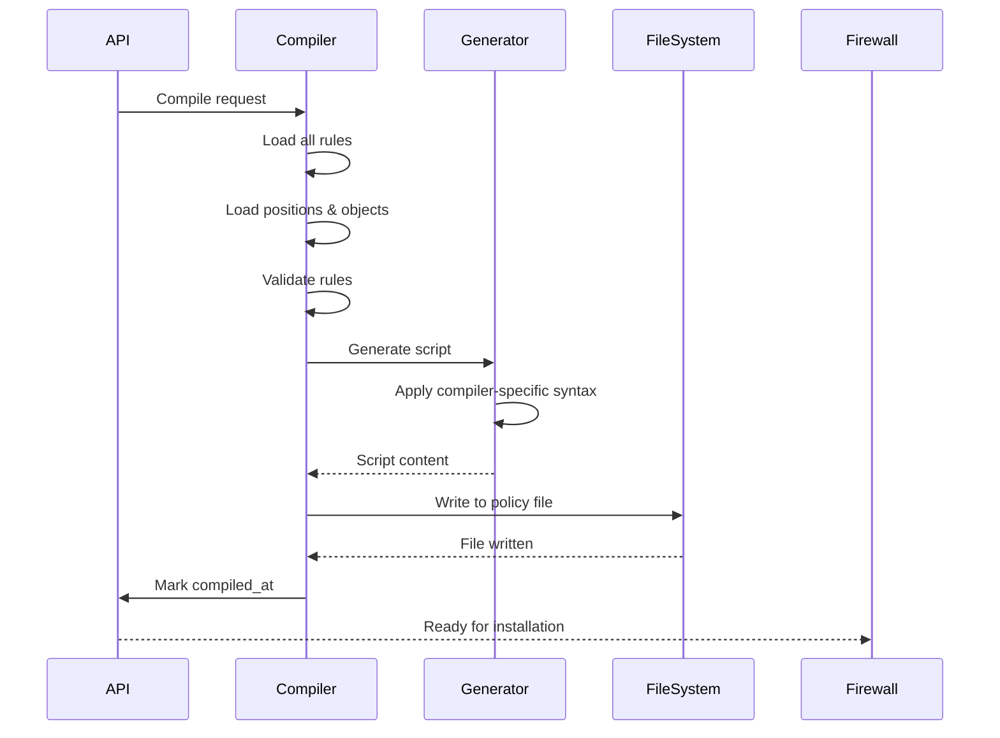

## Policy Rules

Policy rules define how the firewall processes network traffic. They are the core of firewall configuration, specifying filtering, NAT, and routing decisions.

## Data Model

### PolicyRule Entity (PolicyRule.ts:72-210)

```typescript
@Entity('policy_r')
export class PolicyRule extends Model {
  @PrimaryGeneratedColumn()
  id: number;

  @Column()
  rule_order: number;  // Position in rule list

  @Column()
  direction: number;   // Input/Output/Forward

  @Column()
  action: number;      // Accept/Deny/Reject

  @Column()
  comment: string;

  @Column()
  options: number;     // Stateful, Log, etc.

  @Column()
  active: number;      // Rule enabled/disabled

  @Column()
  special: number;     // Special rule type

  @Column()
  negate: string;      // Position negation flags

  @Column({ name: 'firewall' })
  firewallId: number;

  @Column({ name: 'type' })
  policyTypeId: number;  // IPv4, IPv6, etc.

  @Column({ name: 'mark' })
  markId: number;        // Packet marking
}
```

### Key Properties

| Property | Type | Description |
|----------|------|-------------|
| `rule_order` | number | Position in the rule set (1-based) |
| `direction` | number | Traffic direction (INPUT/OUTPUT/FORWARD) |
| `action` | number | What to do with matching packets |
| `options` | number | Bitmap of rule options |
| `active` | number | Whether rule is enabled (1) or disabled (0) |
| `special` | number | Special rule type identifier |
| `negate` | string | Which positions are negated (NOT logic) |

## Rule Positions

Each rule has multiple positions where different objects can be placed:



### Position Types (PolicyPosition.ts)

Standard positions:
- **Source**: Where traffic originates
- **Destination**: Where traffic is going
- **Service**: Protocol and ports
- **Source NAT**: SNAT/Masquerade configuration
- **Destination NAT**: DNAT/Port forwarding configuration

### Objects in Positions

Each position can contain:

#### IP Objects (PolicyRule.ts:173-174)

```typescript
@OneToMany((type) => PolicyRuleToIPObj, (pr2ip) => pr2ip.policyRule)
policyRuleToIPObjs: Array<PolicyRuleToIPObj>;
```

IP addresses, networks, hosts, address ranges.

#### Interfaces (PolicyRule.ts:167-171)

```typescript
@OneToMany((type) => PolicyRuleToInterface, (pr2int) => pr2int.policyRule)
policyRuleToInterfaces: Array<PolicyRuleToInterface>;
```

Network interfaces (eth0, eth1, etc.).

#### OpenVPN Configurations (PolicyRule.ts:176-183)

```typescript
@OneToMany((type) => PolicyRuleToOpenVPN, (pr2vpn) => pr2vpn.policyRule)
policyRuleToOpenVPNs: Array<PolicyRuleToOpenVPN>;

@OneToMany((type) => PolicyRuleToOpenVPNPrefix, (pr2pre) => pr2pre.policyRule)
policyRuleToOpenVPNPrefixes: Array<PolicyRuleToOpenVPNPrefix>;
```

OpenVPN servers and client prefixes.

#### WireGuard Configurations (PolicyRule.ts:185-195)

```typescript
@OneToMany((type) => PolicyRuleToWireGuard, (pr2wg) => pr2wg.policyRule)
policyRuleToWireGuards: Array<PolicyRuleToWireGuard>;

@OneToMany((type) => PolicyRuleToWireGuardPrefix, (pr2wgp) => pr2wgp.policyRule)
policyRuleToWireGuardPrefixes: Array<PolicyRuleToWireGuardPrefix>;
```

WireGuard servers and client prefixes.

#### IPSec Configurations (PolicyRule.ts:197-204)

```typescript
@OneToMany((type) => PolicyRuleToIPSec, (pr2ipsec) => pr2ipsec.policyRule)
policyRuleToIPSecs: Array<PolicyRuleToIPSec>;

@OneToMany((type) => PolicyRuleToIPSecPrefix, (pr2ipsecpre) => pr2ipsecpre.policyRule)
policyRuleToIPSecPrefixes: Array<PolicyRuleToIPSecPrefix>;
```

IPSec servers and client prefixes.

## Special Rules

### Special Rule Types (PolicyRule.ts:48-55)

```typescript
export enum SpecialPolicyRules {
  STATEFUL = 1,     // Connection tracking rules
  CATCHALL = 2,     // Default deny/accept rule
  DOCKER = 3,       // Docker compatibility rules
  CROWDSEC = 4,     // CrowdSec integration
  FAIL2BAN = 5,     // Fail2Ban integration
  HOOKSCRIPT = 6    // Custom script hooks
}
```

### Special Rule Options (PolicyRule.ts:63-67)

```typescript
export const SpecialRuleToFireWallOptMask = new Map([
  [SpecialPolicyRules.STATEFUL, 0x0001],
  [SpecialPolicyRules.DOCKER, 0x0020],
  [SpecialPolicyRules.CROWDSEC, 0x0040],
  [SpecialPolicyRules.FAIL2BAN, 0x0080]
]);
```

Special rules are automatically managed based on firewall options.

## Policy Groups

Rules can be organized into groups for better management:

```typescript
@Entity('policy_g')
export class PolicyGroup extends Model {
  @PrimaryGeneratedColumn()
  id: number;

  @Column()
  name: string;

  @Column()
  groupstyle: string;  // Visual styling

  @Column({ name: 'firewall' })
  firewallId: number;

  @OneToMany((type) => PolicyRule, (rule) => rule.policyGroup)
  policyRules: Array<PolicyRule>;
}
```

Groups provide:
- Visual organization in UI
- Logical separation of rule sets
- Easy enable/disable of rule groups

## Rule Options

### Option Flags (PolicyRule.ts:57-61)

```typescript
export enum PolicyRuleOptMask {
  STATEFUL  = 0x0001,  // Enable connection tracking for this rule
  STATELESS = 0x0002,  // Disable connection tracking
  LOG       = 0x0004   // Log packets matching this rule
}
```

## Compilation Process

### Overview



### Compiler Selection

The firewall's `options` field stores which compiler to use (Firewall.ts:1538-1556):

```typescript
const compilerNumber = (options & 0xf000) >> 12;

switch(compilerNumber) {
  case 0x0: return 'IPTables';   // iptables/iptables-save
  case 0x1: return 'NFTables';   // nftables
  case 0x2: return 'VyOS';       // VyOS configuration
}
```

### IPTables Compiler

Generates iptables-save format scripts:

```bash
#!/bin/bash
# Generated by FWCloud

# Flush existing rules
iptables -F
iptables -X
iptables -t nat -F
iptables -t nat -X

# Default policies
iptables -P INPUT DROP
iptables -P FORWARD DROP
iptables -P OUTPUT ACCEPT

# Stateful rules
iptables -A INPUT -m state --state ESTABLISHED,RELATED -j ACCEPT
iptables -A FORWARD -m state --state ESTABLISHED,RELATED -j ACCEPT

# User rules
iptables -A INPUT -s 192.168.1.0/24 -p tcp --dport 22 -j ACCEPT
# ... more rules

# Save rules
iptables-save > /etc/iptables/rules.v4
```

### NFTables Compiler

Generates nftables format:

```nft
#!/usr/sbin/nft -f
# Generated by FWCloud

flush ruleset

table inet filter {
  chain input {
    type filter hook input priority 0; policy drop;
    ct state established,related accept
    ip saddr 192.168.1.0/24 tcp dport 22 accept
  }
  
  chain forward {
    type filter hook forward priority 0; policy drop;
    ct state established,related accept
  }
  
  chain output {
    type filter hook output priority 0; policy accept;
  }
}
```

### VyOS Compiler

Generates VyOS configuration commands:

```bash
#!/bin/vbash
# Generated by FWCloud

source /opt/vyatta/etc/functions/script-template

configure

delete firewall name INPUT
set firewall name INPUT default-action drop
set firewall name INPUT rule 10 action accept
set firewall name INPUT rule 10 state established enable
set firewall name INPUT rule 10 state related enable
set firewall name INPUT rule 20 action accept
set firewall name INPUT rule 20 source address 192.168.1.0/24
set firewall name INPUT rule 20 destination port 22
set firewall name INPUT rule 20 protocol tcp

commit
save
exit
```

## Policy Installation

### Installation Methods

#### SSH Installation

```typescript
const communication = await firewall.getCommunication();
await communication.uploadFile(
  localPath,
  remotePath,
  { mode: 0o755 }
);
await communication.runCommand('/path/to/script.sh');
```

#### Agent Installation

```typescript
const communication = await firewall.getCommunication();
await communication.installPolicy({
  script: scriptContent,
  type: 'iptables'
});
```

### Installation Workflow

1. **Upload**: Transfer compiled script to firewall
2. **Backup**: Firewall backs up current rules
3. **Execute**: Run new script
4. **Test**: Verify connectivity
5. **Rollback**: Automatic rollback if connection lost
6. **Confirm**: Mark as installed if successful

## Rule Validation

### Validation Checks

- All positions have at least one object (or are marked "any")
- Service objects are valid for the specified protocol
- NAT rules have appropriate source/destination
- Interface references are valid
- VPN references exist
- No circular dependencies in groups

### Dangerous Rules Warning

Rules that may lock out administrators are flagged:
- Blocking all SSH access
- Blocking all HTTPS access to management
- Setting default DROP without exceptions

## Best Practices

### Rule Organization

- Use groups to separate concerns (management, services, DMZ)
- Order rules from specific to general
- Keep rule count reasonable (< 1000 per firewall)
- Document complex rules with comments

### Performance

- Place frequently matched rules near the top
- Use groups instead of individual objects when possible
- Enable stateful tracking for connection-oriented protocols
- Minimize logging (log only what you need)

### Security

- Default deny policy
- Explicit allow rules for required services
- Enable stateful firewall
- Log denied packets for troubleshooting
- Review dangerous rule warnings

### Testing

- Compile policies in test environment first
- Verify connectivity after installation
- Keep backup configurations
- Test rollback procedures
- Document expected behavior

### Maintenance

- Regularly review and clean up unused rules
- Audit rule changes
- Update rules when services change
- Recompile after object modifications
- Monitor firewall logs for blocked legitimate traffic
