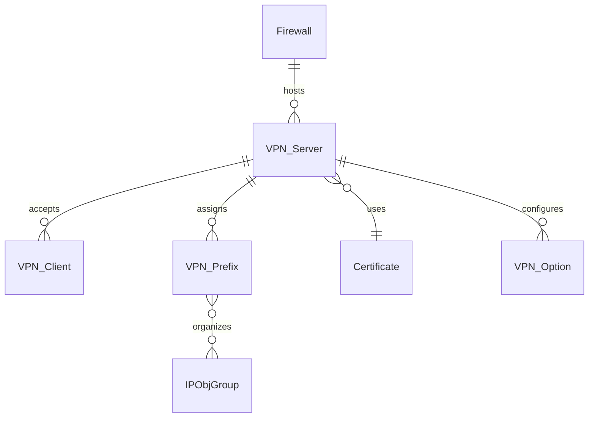

## Overview

FWCloud API supports three VPN technologies for secure remote access and site-to-site connectivity:

- **OpenVPN**: Mature, flexible, widely compatible
- **WireGuard**: Modern, fast, simple configuration
- **IPSec**: Industry standard, hardware accelerated

## Common Architecture

All VPN types share a similar architecture:



### Server/Client Hierarchy

- **Server**: Main VPN configuration on the firewall
- **Client**: Individual VPN client configuration
- **Prefix**: Network prefix assigned to clients (e.g., 10.8.0.0/24)
- **Options**: Key-value configuration pairs

## OpenVPN

### Data Model (OpenVPN.ts:57-151)

```typescript
@Entity('openvpn')
export class OpenVPN extends Model {
  @PrimaryGeneratedColumn()
  id: number;

  @Column()
  install_dir: string;  // Installation directory

  @Column()
  install_name: string; // Configuration filename

  @Column()
  comment: string;

  @Column()
  status: number;       // Installation status

  @Column({ name: 'openvpn' })
  parentId: number;     // Server ID for client configs

  @ManyToOne((type) => OpenVPN, (vpn) => vpn.childs)
  parent: OpenVPN;

  @OneToMany((type) => OpenVPN, (vpn) => vpn.parent)
  childs: Array<OpenVPN>;  // Client configurations

  @Column({ name: 'firewall' })
  firewallId: number;

  @Column({ name: 'crt' })
  crtId: number;        // Certificate for this config

  @ManyToOne((type) => Crt, (crt) => crt.openVPNs)
  crt: Crt;
}
```

### Configuration Structure

#### Server Configuration

A server has:
- **Certificate**: Server certificate from CA
- **Install directory**: Where configs are stored (e.g., `/etc/openvpn`)
- **Install name**: Config file name (e.g., `server.conf`)
- **Options**: Server-specific settings
- **Prefixes**: Client network allocations

#### Client Configuration

```typescript
@Column({ name: 'openvpn' })
parentId: number;  // References server ID
```

Clients reference a parent server and have:
- **Certificate**: Client certificate from same CA
- **Client-specific options**: Routes, pushed configs

### OpenVPN Prefixes

```typescript
@Entity('openvpn_prefix')
export class OpenVPNPrefix extends Model {
  @PrimaryGeneratedColumn()
  id: number;

  @Column()
  name: string;  // Descriptive name

  @Column({ name: 'openvpn' })
  openVPNId: number;

  @ManyToOne((type) => OpenVPN)
  openVPN: OpenVPN;
}
```

**Purpose**: Define which network ranges are used by VPN clients, allowing you to reference "All OpenVPN clients" in policy rules.

### Usage in Policies

OpenVPN servers and clients can be used in policy rules:

```typescript
@OneToMany((type) => PolicyRuleToOpenVPN, (pr2vpn) => pr2vpn.policyRule)
policyRuleToOpenVPNs: Array<PolicyRuleToOpenVPN>;

@OneToMany((type) => PolicyRuleToOpenVPNPrefix, (pr2pre) => pr2pre.policyRule)
policyRuleToOpenVPNPrefixes: Array<PolicyRuleToOpenVPNPrefix>;
```

**Example rule**: Allow all OpenVPN clients to access internal web server:
- Source: OpenVPN Prefix (10.8.0.0/24)
- Destination: Web Server (192.168.1.10)
- Service: HTTPS
- Action: Accept

### Typical OpenVPN Options

```conf
# Server options
port 1194
proto udp
dev tun
ca ca.crt
cert server.crt
key server.key
dh dh2048.pem
server 10.8.0.0 255.255.255.0
ifconfig-pool-persist ipp.txt
push "route 192.168.1.0 255.255.255.0"
keepalive 10 120
cipher AES-256-CBC
user nobody
group nogroup
persist-key
persist-tun
status openvpn-status.log
verb 3
```

## WireGuard

### Data Model (WireGuard.ts:60-160)

```typescript
@Entity('wireguard')
export class WireGuard extends Model {
  @PrimaryGeneratedColumn()
  id: number;

  @Column()
  install_dir: string;

  @Column()
  install_name: string;

  @Column()
  comment: string;

  @Column()
  status: number;

  @Column({ type: 'varchar', length: 255 })
  public_key: string;   // Encrypted

  @Column({ type: 'varchar', length: 255 })
  private_key: string;  // Encrypted

  @Column({ name: 'wireguard' })
  parentId: number;

  @ManyToOne((type) => WireGuard, (wg) => wg.childs)
  parent: WireGuard;

  @OneToMany((type) => WireGuard, (wg) => wg.parent)
  childs: Array<WireGuard>;

  @Column({ name: 'firewall' })
  firewallId: number;

  @Column({ name: 'crt' })
  crtId: number;  // Used for naming, not actual PKI
}
```

### Key Management

WireGuard uses Curve25519 public/private key pairs instead of X.509 certificates:

```typescript
public static async generateKeyPair(): Promise<{
  public_key: string;
  private_key: string;
}> {
  await sodium.ready;
  const { publicKey, privateKey } = sodium.crypto_kx_keypair();
  
  return {
    public_key: sodium.to_base64(publicKey),
    private_key: sodium.to_base64(privateKey)
  };
}
```

**Security**: Keys are encrypted before storage using the application's encryption system.

### WireGuard Prefixes

Similar to OpenVPN:

```typescript
@Entity('wireguard_prefix')
export class WireGuardPrefix extends Model {
  @PrimaryGeneratedColumn()
  id: number;

  @Column()
  name: string;

  @Column({ name: 'wireguard' })
  wireGuardId: number;

  @ManyToOne((type) => WireGuard)
  wireGuard: WireGuard;
}
```

### Usage in Policies

```typescript
@OneToMany((type) => PolicyRuleToWireGuard, (pr2wg) => pr2wg.policyRule)
policyRuleToWireGuards: Array<PolicyRuleToWireGuard>;

@OneToMany((type) => PolicyRuleToWireGuardPrefix, (pr2wgp) => pr2wgp.policyRule)
policyRuleToWireGuardPrefixes: Array<PolicyRuleToWireGuardPrefix>;
```

### Typical WireGuard Configuration

**Server config** (`/etc/wireguard/wg0.conf`):
```conf
[Interface]
PrivateKey = <server-private-key>
Address = 10.9.0.1/24
ListenPort = 51820

[Peer]
# Client 1
PublicKey = <client1-public-key>
AllowedIPs = 10.9.0.2/32

[Peer]
# Client 2
PublicKey = <client2-public-key>
AllowedIPs = 10.9.0.3/32
```

**Client config**:
```conf
[Interface]
PrivateKey = <client-private-key>
Address = 10.9.0.2/32
DNS = 8.8.8.8

[Peer]
PublicKey = <server-public-key>
Endpoint = firewall.example.com:51820
AllowedIPs = 0.0.0.0/0
PersistentKeepalive = 25
```

## IPSec

### Data Model (IPSec.ts:63-154)

```typescript
@Entity('ipsec')
export class IPSec extends Model {
  @PrimaryGeneratedColumn()
  id: number;

  @Column()
  install_dir: string;

  @Column()
  install_name: string;

  @Column()
  comment: string;

  @Column()
  status: number;

  @Column({ name: 'ipsec' })
  parentId: number;

  @ManyToOne((type) => IPSec, (ipsec) => ipsec.childs)
  parent: IPSec;

  @OneToMany((type) => IPSec, (ipsec) => ipsec.parent)
  childs: Array<IPSec>;

  @Column({ name: 'firewall' })
  firewallId: number;

  @Column({ name: 'crt' })
  crtId: number;  // Certificate for authentication
}
```

### IPSec Prefixes

```typescript
@Entity('ipsec_prefix')
export class IPSecPrefix extends Model {
  @PrimaryGeneratedColumn()
  id: number;

  @Column()
  name: string;

  @Column({ name: 'ipsec' })
  ipSecId: number;

  @ManyToOne((type) => IPSec)
  ipSec: IPSec;
}
```

### Usage in Policies

```typescript
@OneToMany((type) => PolicyRuleToIPSec, (pr2ipsec) => pr2ipsec.policyRule)
policyRuleToIPSecs: Array<PolicyRuleToIPSec>;

@OneToMany((type) => PolicyRuleToIPSecPrefix, (pr2ipsecpre) => pr2ipsecpre.policyRule)
policyRuleToIPSecPrefixes: Array<PolicyRuleToIPSecPrefix>;
```

### IPSec Configuration Types

IPSec supports multiple configurations:

#### IKEv2 with Certificates

Uses X.509 certificates for authentication:
```conf
conn roadwarrior
  auto=add
  type=tunnel
  keyexchange=ikev2
  left=%any
  leftcert=server.crt
  leftid=@firewall.example.com
  leftsubnet=0.0.0.0/0
  right=%any
  rightauth=eap-mschapv2
  rightsourceip=10.10.0.0/24
  rightdns=8.8.8.8
```

#### Site-to-Site

Connect two networks:
```conf
conn site-to-site
  auto=start
  type=tunnel
  keyexchange=ikev2
  left=203.0.113.1
  leftsubnet=192.168.1.0/24
  leftcert=site1.crt
  right=203.0.113.2
  rightsubnet=192.168.2.0/24
  rightcert=site2.crt
```

## VPN Options

All VPN types support custom options:

```typescript
@Entity('openvpn_opt')
export class OpenVPNOption extends Model {
  @PrimaryGeneratedColumn()
  id: number;

  @Column()
  name: string;   // Option name

  @Column()
  arg: string;    // Option value/argument

  @Column()
  order: number;  // Order in config file

  @Column({ name: 'openvpn' })
  openVPNId: number;
}
```

Similar structures exist for `wireguard_opt` and `ipsec_opt`.

## Integration with IP Object Groups

VPN prefixes can be organized into groups:

```typescript
@ManyToMany((type) => IPObjGroup, (group) => group.openVPNs)
@JoinTable({
  name: 'openvpn__ipobj_g',
  joinColumn: { name: 'openvpn' },
  inverseJoinColumn: { name: 'ipobj_g' }
})
ipObjGroups: Array<IPObjGroup>;
```

This allows grouping VPN clients for policy management:
- All Remote Workers (OpenVPN + WireGuard clients)
- Partner VPNs (IPSec site-to-site)
- Management Access (Specific VPN clients)

## Routing Integration

VPNs can be used in routing rules and tables:

```typescript
@OneToMany(() => RoutingRuleToOpenVPN, (model) => model.openVPN)
routingRuleToOpenVPNs: RoutingRuleToOpenVPN[];

@OneToMany(() => RouteToOpenVPN, (model) => model.openVPN)
routeToOpenVPNs: RouteToOpenVPN[];
```

**Example**: Route all VPN traffic through a specific gateway or interface.

## Comparison Matrix

| Feature | OpenVPN | WireGuard | IPSec |
|---------|---------|-----------|-------|
| **Maturity** | Very mature | Modern | Industry standard |
| **Performance** | Good | Excellent | Good (HW accel) |
| **Ease of Setup** | Moderate | Easy | Complex |
| **Authentication** | X.509 certs | Public keys | Certs or PSK |
| **Mobile Support** | Excellent | Excellent | Native iOS/Android |
| **Port** | UDP 1194 | UDP 51820 | UDP 500/4500 |
| **NAT Traversal** | Built-in | Built-in | NAT-T required |
| **Protocol** | TLS-based | Custom | ESP/AH |
| **Encryption** | OpenSSL | ChaCha20 | Various |
| **Configuration** | Complex | Simple | Very complex |
| **Roaming** | Good | Excellent | Fair |

## Best Practices

### Choosing a VPN Type

**Use OpenVPN when**:
- You need maximum compatibility
- Existing infrastructure uses OpenVPN
- You need complex configurations
- You want TCP fallback option

**Use WireGuard when**:
- You want best performance
- You prefer simple configuration
- You're starting fresh
- Mobile roaming is important

**Use IPSec when**:
- Connecting to enterprise networks
- Hardware acceleration is available
- Native OS support is required
- Site-to-site VPN is primary use case

### Security

- **Rotate keys/certificates regularly**: Especially for long-lived servers
- **Use strong encryption**: AES-256 for OpenVPN, default for WireGuard
- **Limit client access**: Don't grant full network access by default
- **Monitor connections**: Track active sessions and anomalies
- **Revoke compromised credentials**: Maintain and use CRLs

### Performance

- **Use UDP**: Better performance than TCP for VPN
- **Tune MTU**: Avoid fragmentation (typically 1400 for VPN)
- **Enable compression cautiously**: Can reduce performance
- **Consider WireGuard**: If performance is critical
- **Use hardware acceleration**: For IPSec when available

### Configuration Management

- **Document configurations**: Keep notes on purpose and settings
- **Use prefixes**: Group client networks logically
- **Organize with groups**: Use IP object groups for policy management
- **Test before deploying**: Verify connectivity and routing
- **Keep backups**: Save working configurations

### Monitoring

- **Track connected clients**: Know who's connected
- **Monitor bandwidth**: Identify heavy users
- **Check logs**: Watch for authentication failures
- **Alert on issues**: Set up monitoring for VPN services
- **Review access**: Regularly audit who has VPN access
